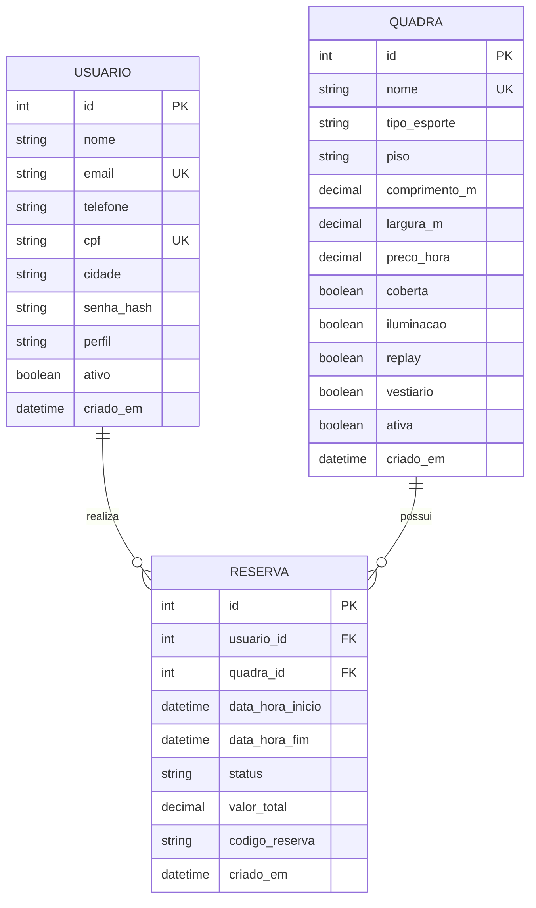

```mermaid  
erDiagram
    USUARIO {
        int id PK
        string nome
        string email UK
        string telefone
        string cpf UK
        string cidade
        string senha_hash
        string perfil
        boolean ativo
        datetime criado_em
    }
    
    QUADRA {
        int id PK
        string nome UK
        string tipo_esporte
        string piso
        decimal comprimento_m
        decimal largura_m
        decimal preco_hora
        boolean coberta
        boolean iluminacao
        boolean replay
        boolean vestiario
        boolean ativa
        datetime criado_em
    }
    
    RESERVA {
        int id PK
        int usuario_id FK
        int quadra_id FK
        datetime data_hora_inicio
        datetime data_hora_fim
        string status
        decimal valor_total
        string codigo_reserva
        datetime criado_em
    }

    USUARIO ||--o{ RESERVA : "realiza"
    QUADRA ||--o{ RESERVA : "possui"
```
