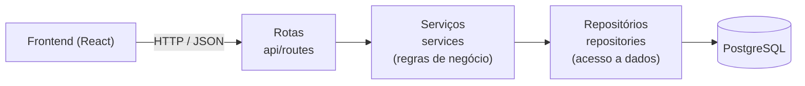

# Reserva Gávea — Sistema de Reserva de Quadras Esportivas

Aplicação web para **buscar, reservar e gerenciar quadras e campos esportivos**. O sistema atende dois perfis:

- **Atleta** — busca quadras por esporte e data, consulta a grade de horários e faz reservas.
- **Administrador** — cadastra e mantém as quadras do complexo (horários de funcionamento, preços e comodidades).

Um dos principais objetivos técnicos é **garantir que um mesmo horário nunca seja reservado por duas pessoas**, inclusive quando os pedidos chegam ao mesmo tempo.

Projeto acadêmico da disciplina de **Laboratório de Engenharia de Software**.

---

## Equipe

- Gustavo Felipe Morais
- Mariana Cavalcante Lins
- Uanderson Leonardo de Souza

---

## Funcionalidades (Sprint 1)

| História | Funcionalidade |
| --- | --- |
| **US01** — Autenticação | Cadastro e login com JWT, perfis de atleta e administrador, sessão encerrada automaticamente quando o token expira |
| **US08** — Infraestrutura (Admin) | CRUD completo de quadras: cadastrar, listar, editar, inativar e reativar |
| **US03** — Busca | Filtro de quadras por esporte e por data (mostra só quadras com horário livre no dia) |
| **US04** — Grade de horários | Grade por quadra e por dia, cruzando o horário de funcionamento com as reservas existentes |
| **US05** — Confirmação de reserva | Revisão e confirmação da reserva com bloqueio do horário, inclusive em pedidos simultâneos |

---

## Stack

| Camada | Tecnologias |
| --- | --- |
| Backend | Python, **FastAPI**, SQLAlchemy 2, Alembic (migrações), Pydantic, JWT (python-jose), argon2 (pwdlib) |
| Banco de dados | **PostgreSQL** |
| Frontend | **React** 19 + TypeScript, Vite |

---

## Arquitetura

O backend é organizado em camadas, cada uma com uma responsabilidade:



| Pasta | Responsabilidade |
| --- | --- |
| `api/routes` | Recebe as requisições HTTP, valida a entrada com os schemas e chama o serviço. Não contém regra de negócio. |
| `services` | Regras de negócio (ex.: horário já iniciado, preço alterado, limite de 30 dias). |
| `repositories` | **Único lugar com acesso ao banco** (consultas, inserções e atualizações). |
| `models` | Entidades do banco (SQLAlchemy). |
| `schemas` | Formatos de entrada e saída da API (Pydantic). |
| `core` | Configuração, segurança (JWT e senhas), exceções de domínio e horário oficial. |

### Repository Pattern

Toda operação no banco fica em classes de repositório (`UsuarioRepository`, `QuadraRepository`, `ReservaRepository`). Os serviços recebem o repositório pronto e não conhecem SQL nem a sessão do banco. Isso isola as regras de negócio do acesso a dados e permite trocar ou simular o banco sem mexer nas regras.

Restrição do projeto: **não há decorators customizados nas regras de negócio**. Os únicos decorators usados são os da própria infraestrutura (rotas do FastAPI, validadores do Pydantic e `@dataclass`).

### Garantia contra reserva duplicada

A regra "um horário, uma reserva" é garantida **pelo próprio banco**, com um índice único em quadra + data + horário (desconsiderando reservas canceladas). Se dois atletas confirmarem o mesmo horário ao mesmo tempo, só um consegue; o outro recebe a resposta `409 — Esse horário já foi reservado`. Em teste com **10 pedidos simultâneos para o mesmo horário, apenas 1 reserva foi criada**.

### Frontend

Componentes funcionais com Hooks. As chamadas à API ficam em `src/services`, separadas das telas (`src/pages`) e dos componentes (`src/components`); a lógica de estado reutilizável fica em `src/hooks`.

---

## Rotas da API

Documentação interativa completa em `http://127.0.0.1:8000/docs` com a API rodando.

| Método | Rota | Acesso | Descrição |
| --- | --- | --- | --- |
| POST | `/auth/register` | público | cadastro de atleta |
| POST | `/auth/login` | público | login (retorna o token JWT) |
| GET | `/auth/me` | logado | dados do usuário logado |
| GET | `/quadras?esporte=&data=` | público | quadras ativas, com filtros opcionais |
| GET | `/quadras/{id}` | público | detalhe de uma quadra ativa |
| GET | `/quadras/{id}/horarios?data=` | público | grade de horários do dia |
| POST | `/reservas` | logado | cria uma reserva |
| GET / POST | `/admin/quadras` | administrador | lista todas / cadastra |
| PUT / DELETE | `/admin/quadras/{id}` | administrador | edita / inativa |

---

## Como rodar

O passo a passo completo (banco, backend, frontend e criação do administrador) está em
**[Atv_grupo_1/documents/InstallationGuide.md](Atv_grupo_1/documents/InstallationGuide.md)**.

Resumo, com o PostgreSQL já rodando e o `.env` configurado:

```bash
# backend
cd Atv_grupo_1/backend
python -m venv .venv && source .venv/bin/activate   # Windows: .venv\Scripts\Activate.ps1
pip install -r requirements.txt
alembic upgrade head
uvicorn app.main:app --reload

# frontend (outro terminal)
cd Atv_grupo_1/frontend
npm install
npm run dev        # http://localhost:5173
```

---

## Testes

O backend tem **97 testes automatizados** (pytest) cobrindo autenticação, CRUD de quadras, busca, grade de horários, regras de reserva e concorrência, executados contra um banco PostgreSQL de testes separado.

```bash
cd Atv_grupo_1/backend
pip install -r requirements-dev.txt
pytest
```

Resultados, casos de teste e o detalhamento do teste de concorrência (50 pedidos simultâneos em 5 rodadas: 5 aprovados, 45 barrados, nenhuma reserva duplicada) estão em
**[Atv_grupo_1/documents/TestExecutionReport.md](Atv_grupo_1/documents/TestExecutionReport.md)**.

---

## Estrutura do repositório

```text
Atv_grupo_1/
├── backend/
│   ├── alembic/versions/   # migrações do banco
│   ├── app/
│   │   ├── api/routes/     # rotas HTTP
│   │   ├── core/           # configuração, segurança, exceções, horário
│   │   ├── db/             # conexão com o banco
│   │   ├── models/         # entidades
│   │   ├── repositories/   # acesso a dados (Repository Pattern)
│   │   ├── schemas/        # entrada/saída da API
│   │   ├── scripts/        # utilitários (promover administrador)
│   │   └── services/       # regras de negócio
│   └── tests/              # testes automatizados (pytest)
├── frontend/
│   └── src/
│       ├── components/     # componentes reutilizáveis
│       ├── hooks/          # lógica de estado (sessão, quadras, grade, relógio)
│       ├── pages/          # telas
│       ├── services/       # chamadas à API
│       ├── styles/         # CSS
│       └── utils/          # formatação de datas, preços e esportes
└── documents/              # guia de instalação e relatório de testes
```

---

## Próximas etapas

| História | Descrição |
| --- | --- |
| US02 | Perfil do usuário (ver e editar dados) |
| US06 | Pagamento simulado da reserva |
| US07 | Minhas reservas e cancelamento |
| US09 | Regras de preço por dia e horário |
| US10 | Agenda do dia para a recepção |
| US11 | Relatórios e gráficos de ocupação e faturamento |

---

## Fluxo de trabalho

- `main` — versões entregues ao fim de cada sprint.
- `Develop` — integração do trabalho em andamento.
- Uma branch por funcionalidade (`feat/...`, `fix/...`, `chore/...`, `docs/...`), integrada à `Develop` por Pull Request.
